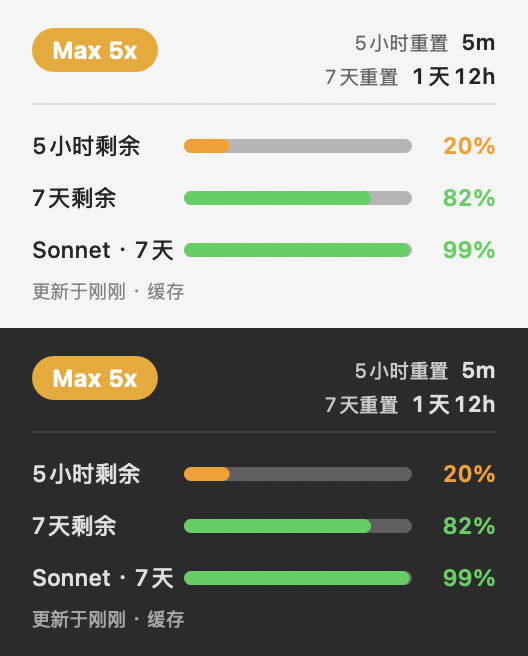

<div align="center">

# ClaudeUsage

**A macOS menu-bar app that tracks your Claude subscription usage in real time**

5‑hour / 7‑day remaining quota, per‑model usage, plan, and reset times — always in your menu bar, and optionally in the system **Edit Widgets** gallery.

[](#requirements)
[](LICENSE)
[](#how-it-works)

[简体中文](README.md) | English



</div>

---

## Features

- **Lives in the menu bar** — a battery-style gauge ring (fills by 5‑hour remaining, in 20% steps) plus the remaining percentage; refreshes about every 15 s.
- **Dropdown panel** — plan badge, 5‑hour / 7‑day reset countdowns, horizontal remaining-quota bars (5‑hour / 7‑day / per‑model), and last-updated time; transparent background that blends with the menu and adapts to light/dark.
- **Native widget** — an embedded WidgetKit extension you can add from the system **Edit Widgets** gallery (small / medium), iOS battery-ring style, with a manual refresh button (↻).
- **Desktop floating widget** — a ring card pinned to the desktop layer, **hidden by default**, toggled from the menu.
- **Auto-refresh** — pulls the official usage endpoint every 60 s, independent of whether Claude Code is running; colored by remaining amount (green / yellow / orange / red).

## Requirements

| Dependency | Notes |
| --- | --- |
| macOS 14+ | Required by the WidgetKit widget |
| [XcodeGen](https://github.com/yonaskolb/XcodeGen) | `brew install xcodegen` — generates the project from `project.yml` |
| Xcode | Provides `swiftc` / WidgetKit and code signing |
| Apple ID (free works) | Only the gallery widget needs a Team‑ID signature; the menu-bar / floating widget run unsigned |

## Build & Install

```bash
./build.sh                                   # → build/ClaudeUsage.app
cp -R build/ClaudeUsage.app /Applications/   # install
open /Applications/ClaudeUsage.app           # launch — gauge icon appears in the menu bar
./install-autostart.sh                       # (optional) start at login
```

`build.sh` generates the project with XcodeGen, compiles with `xcodebuild`, and auto-detects the Team ID from an **Apple Development** certificate in your keychain. You can also set it explicitly:

```bash
DEVELOPMENT_TEAM=XXXXXXXXXX ./build.sh
```

With no certificate it falls back to an ad-hoc build — the menu-bar / floating widget work, but the native widget cannot enter the gallery (see below).

> A prebuilt package is in [`release/ClaudeUsage.dmg`](release/ClaudeUsage.dmg). ⚠️ It is signed with a free development certificate and is **only trusted on the Mac that built it** — others should build from source.

## Code Signing (to appear in the widget gallery)

macOS's widget-gallery daemon `chronod` enforces a signing-trust gate on third-party extensions: it **only accepts a signature with a real Apple-issued Team ID**. Ad-hoc / self-signed extensions are purged on the spot and never appear in the gallery. **A free Apple Development certificate is enough** — no paid membership, no App Store.

1. Xcode → Settings → Accounts, sign in with your Apple ID (free personal team) → **Manage Certificates** → `+` → **Apple Development**.
2. If `codesign` reports `unable to build chain to self-signed root`, install the Apple WWDR G3 intermediate (Xcode occasionally misses it):
   ```bash
   curl -fsSL -o /tmp/wwdr.cer https://www.apple.com/certificateauthority/AppleWWDRCAG3.cer
   security import /tmp/wwdr.cer -k ~/Library/Keychains/login.keychain-db
   ```
3. `./build.sh` → install to Applications and launch once → right-click the desktop → **Edit Widgets** to add it.

> Development signing is only trusted on your own / registered devices and **cannot be distributed to others**; the certificate lasts about 1 year (just rerun `./build.sh` to re-sign). To produce a package anyone can run, you need a paid Apple Developer Program ($99/yr) + Developer ID signing + notarization (not App Store).

## Data Source & Privacy

The primary source is Anthropic's official usage endpoint `api.anthropic.com/api/oauth/usage`, accessed with **Claude Code's own login token** (read from the `Claude Code-credentials` keychain item or `~/.claude/.credentials.json` — **read-only**, never modified, renewed, or uploaded).

- Prerequisite: you've logged into `claude` in the terminal with a subscription account. The first keychain read prompts macOS for permission — choose **Always Allow**.
- The plan (Pro / Max) is auto-detected from the OAuth profile; you can also pick it manually from the menu.
- **Optional fallback**: Claude Code's `statusLine` hook (`statusline.py`) writes usage to `~/.claude/usage-cache.json`, used when no token is available. Enable it by adding to `~/.claude/settings.json`:
  ```json
  "statusLine": { "type": "command", "command": "/absolute/path/statusline.py", "padding": 0 }
  ```

No secrets are hardcoded; everything runs locally. The WidgetKit extension is sandboxed and reads only its own container (the menu-bar app feeds data into it).

## Refresh Cadence

| Where | Cadence |
| --- | --- |
| Menu-bar percentage | ~15 s |
| Underlying data (API poll) | ≤ 60 s |
| Native widget redraw | Scheduled by WidgetKit's budget, roughly every 5–15 min (countdown text ticks live every minute) |
| Widget refresh button ↻ | Immediate (triggers the menu-bar app to fetch and reload) |

## Project Structure

```
ClaudeUsage.m              Menu-bar app + floating widget (drawing, status item, menu panel, 60s API poll, ping watch)
WidgetReload.swift         @objc bridge so the ObjC app can reload widgets via WidgetCenter
widget/
  ClaudeUsageWidget.swift  WidgetKit extension (SwiftUI, with a refresh-button AppIntent)
  widget.entitlements      app-sandbox only (reads its own container → no provisioning profile needed)
statusline.py              Claude Code statusLine hook (optional fallback data source)
project.yml                XcodeGen project definition (two targets; signing injected by build.sh)
build.sh                   Build script (XcodeGen + xcodebuild, auto-detects signing)
make-icon.sh               Generates AppIcon.icns
install-autostart.sh       Installs a login LaunchAgent
```

## How It Works

- The menu-bar app is **Objective-C** (Cocoa + Security + WidgetKit); the WidgetKit extension is **SwiftUI**; the mixed-language target is assembled by XcodeGen.
- The extension declares only `app-sandbox` and reads its own container; the non-sandboxed menu-bar app mirrors the usage JSON into that container every 60 s — so no restricted entitlement or provisioning profile is needed, and a single Team-ID certificate clears the gallery gate.
- The widget's refresh button is an AppIntent: it writes a ping file → the menu-bar app detects it → fetches the API immediately → reloads via `WidgetCenter`.
- The floating window sits at `NSNormalWindowLevel - 1` (desktop layer, still clickable); it can't use `kCGDesktopIconWindowLevel`, whose mouse events are claimed by Finder.
- Offscreen preview (doesn't touch your screen): `build/ClaudeUsage.app/Contents/MacOS/ClaudeUsage --render-menu out.png` or `--render out.png`.

## License

[MIT](LICENSE) © 2026 Minghao. Not affiliated with Anthropic; "Claude" is a trademark of Anthropic.
